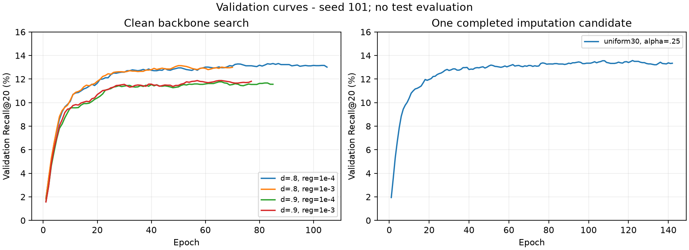
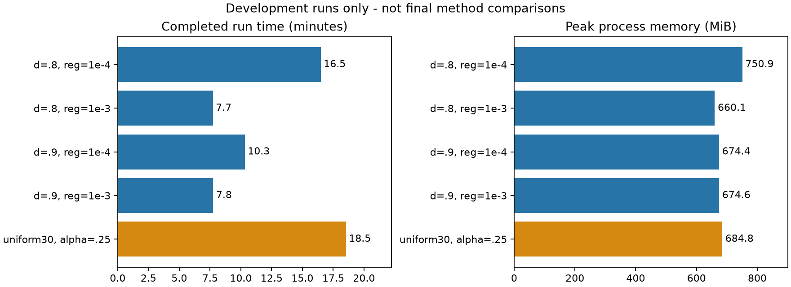

# Interim findings: CPU FREEDOM reproduction

This report records completed **development-stage validation**, not the planned full study. On 2026-09-30, five of 16 development configurations had completed; a sixth had a valid epoch-35 partial checkpoint. None of the 45 planned main runs had started. Training was stopped at this boundary, and no published test-set score or benefit from the proposed `support_mix` method is available.

## Scope and data

The model uses author-preprocessed Amazon Baby image (4,096-dimensional) and text (384-dimensional) features. A training-stratified target of 2,000 items yielded **1,993 items and 8,967 users** after training-only pruning. The retained split contains 27,977 training, 2,944 validation, and 3,359 test interactions; 2,803 users have validation positives. The model trains on CPU, while the original image and language encoders are not run. This subset cannot be compared numerically with the paper's full-dataset results. See [data provenance](data-provenance.md) and the [reproduction map](reproduction-map.md).

The author's feature preprocessing may have filled some native missing images with a mean vector. Native availability labels were not supplied. Accordingly, `clean` means no **additional artificial masking**, and the planned `uniform30` and `tail30` conditions study only artificial masking of preprocessed vectors.

## Completed validation runs

All rows use **development seed 101**. Each reported epoch was selected by overall validation Recall@20; Recall and NDCG are validation metrics, not independent test metrics. Wall time includes initialization, training, evaluation, and checkpoint saving. RSS is an observed process peak, not whole-system memory.

| Condition | Validation Recall@20 | Validation NDCG@20 | Best / completed epoch | Minutes | Peak RSS (MiB) |
|---|---:|---:|---:|---:|---:|
| clean; dropout .8; reg 1e-4 | 13.3173% | 5.9899% | 85 / 105 | 16.49 | 750.90 |
| clean; dropout .8; reg 1e-3 | 13.1377% | 5.8031% | 50 / 70 | 7.73 | 660.11 |
| clean; dropout .9; reg 1e-4 | 11.7642% | 5.3535% | 65 / 85 | 10.32 | 674.39 |
| clean; dropout .9; reg 1e-3 | 11.8712% | 5.3481% | 57 / 77 | 7.75 | 674.60 |
| uniform30; fixed_mix; alpha .25 | 13.5718% | 6.1079% | 122 / 142 | 18.53 | 684.82 |

The prespecified overall validation criterion selected **dropout .8, reg 1e-4** among the four `clean` backbone candidates; [selection metadata](../results/development/backbone_selection.json) records the decision. All five completed runs stopped after validation patience, rather than the 200-epoch limit. Early stopping is not proof of mathematical convergence. The fifth row is a *fixed-mix* candidate, **not** `support_mix`. Its larger validation number cannot show that missing images help or that imputation improves generalization: there is no held-out comparison, three-seed estimate, or complete set of missing-image controls. Neither alpha nor tau was fully selected.





The five completed runs total about **60.81 minutes** on an i7-12700H with two CPU training threads. Their observed 7.73–18.53 minute durations and 660.11–750.90 MiB RSS peaks do not predict cost for unfinished conditions or another machine.

## Verification and publication boundary

The historical integration test run recorded **76 passed tests and 30 passing subtests** (106 JUnit cases), including upstream-model calculation comparisons. Separately, the five completed `best.pt` checkpoints were loaded on CPU, and validation Top-20 rankings for all 2,803 evaluable users were recomputed. Saved rankings, per-user metrics, and summaries matched. The check also compared registered artifact hashes and run identity; all five runs had test evaluation disabled (`test=null`). The [verification JSON](../results/interim/verification.json) records `success=true`, `training_performed=false`, and `test_evaluated=false`.

The repository publishes the [five-row CSV](../results/interim/development_summary.csv), figures, and verification metadata, but **not** raw or prepared data, checkpoints, original run directories, or per-user results. These published records document an already executed check; they are insufficient by themselves to repeat checkpoint prediction. To reproduce it, first obtain the author-hosted data and generate local runs with the provided code. `scripts/export_interim.py` expects those local artifacts.

The sixth, unfinished `tail30` fixed-mix run is excluded from this table and all averages. Its epoch-35 checkpoint is not distributed. No main-study test scores, paired differences, single-modality ablation results, final effect plots, or success/failure cases exist in the published stage result.

## What remains a research question

The candidate micro-change is a one-step visible-neighbor image fill:

```text
support_mix = (sum of visible neighbor vectors + tau × visible global mean)
              / (visible neighbor count + tau)
```

It uses up to 20 training co-interaction neighbors, falls back to the visible global mean with zero support, and never reads hidden vectors or recursively uses imputed vectors. The implementation and controls exist, but the effect of support-dependent shrinkage has **not been evaluated** in the completed runs. [Support-count diagnostics](support-diagnostics.md) show that the count varies under the planned masks; that is graph structure evidence, not recommendation benefit or calibrated confidence. [Related work](related-work.md) also prevents a claim of a new graph-imputation principle.

The planned complete study would need the remaining 11 development configurations, parameter freezing, 45 main runs with three paired seeds, test rankings, ablations, and case analysis. Consequently this report supports only the CPU engineering reproduction and the five development validation observations above.
