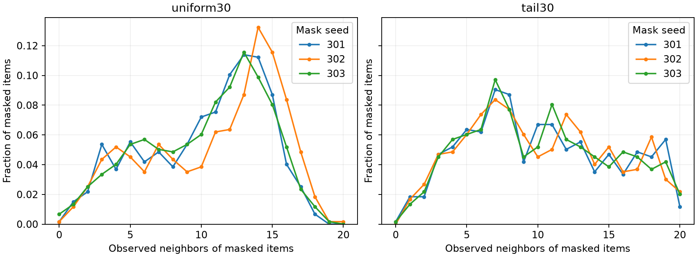

# 正式测试前的有效邻居诊断

日期：2026-09-30。该诊断只使用固定子集的训练共交互图与预先指定的主实验掩码301/302/303，不计算任何推荐成绩，不选择alpha/tau，也不据此重抽子集或改变实验矩阵。

每个条件遮蔽597/1993件商品，即29.9548%。`tail30`将597件全部放在训练热度后半的997件商品中，长尾内部缺失率为59.8796%。这验证了“全目录约30%”与“长尾内部约60%”是两个不同分母。

| 场景 | 掩码种子 | 有效邻居均值 | 中位数 | 范围 | 零支持比例 | 触及20上限比例 |
|---|---:|---:|---:|---|---:|---:|
| uniform30 | 301 | 10.330 | 11 | 0–18 | 0.1675% | 0% |
| uniform30 | 302 | 10.990 | 12 | 0–20 | 0.1675% | 0.1675% |
| uniform30 | 303 | 10.333 | 11 | 0–19 | 0.6700% | 0% |
| tail30 | 301 | 10.218 | 10 | 0–20 | 0.1675% | 1.1725% |
| tail30 | 302 | 10.184 | 10 | 1–20 | 0% | 2.1776% |
| tail30 | 303 | 10.188 | 10 | 0–20 | 0.1675% | 2.0101% |



有效支持量并非近似常数：每个条件出现19–21种支持数量，因此候选规则确实能对不同商品给出不同混合权重。长尾集中场景中支持量分布更分散；这些是本固定图与掩码的描述统计，不是所有数据集的性质。

这一结果只说明适合继续检验假设。它不证明少支持商品的补全一定更差，也不证明支持量是校准的置信度。两种场景的缺图商品集合不同，不能将均值差解释为同一批商品的因果差。零支持商品占比很小，后续若有收益，仍须通过observed_mean与fixed_mix对照判断，不预先归因为回退策略。

三个tau候选与三个固定alpha候选覆盖的有效混合权重并不完全相同；即使超过这组固定混合搜索，也不能证明超过所有连续alpha的最优值。这是预定有限搜索的限制，应进入最终结论边界，不在观察结果后悄悄扩网格。

完整数值在 [support_pretest.csv](../results/diagnostics/support_pretest.csv)，数据/训练划分/源码身份和直方图在 [support_pretest.json](../results/diagnostics/support_pretest.json)。图的纵轴统一、从零开始，已做可视检查；这些训练图诊断不能代替正式效果图。

可重复命令（已实际执行）：

```powershell
.venv\Scripts\python.exe scripts/inspect_support.py --data data/processed/baby2000 --output results/diagnostics --plot
```
